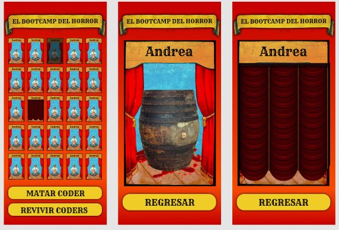
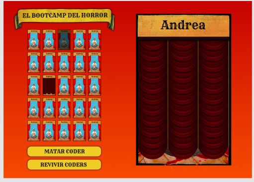

# Wheel-of-Doom

## Table of contents

1. [General Info](#general-info)
2. [Design](#design)
3. [Technologies](#technologies)
4. [To do](#to-do)
5. [Collaborators](#collaborators)

## General Info
***

The goal of the Wheel of Doom is to create a fair and random sacrifice selection system for coders, like a videogame, for to kill players. It's responsive and made with html, css and with a minimum of 4 functions of javascript.

## Design 
***
The design was made with figma after searching references, we wanted a videogame with old style circus characters and with some felling of terror because it is a game of killing players. 

## Technologies
***
We use html, css and javascript. In this project we used some JS functions and one of them is the construction of HTML which made it simpler. We use functions to kill a coder and eliminate it from the game, relive it, restart the game ... We used new css functions like animations with sound. It is responsive and was developed with a focus on mobile. We have made a TDD of the function to randomly select a player and eliminate him.

## To do
***
Some points were missing because we give priority to better understand the functions and make the game work. It is missing to make a bucle for the game to continue and responsive for Desktop.

## Collaborators
***
Gabriela Piñeiro,
Berta López,
Joan Recorda,
Sergio Corcuera,
Alexandra Galarza
